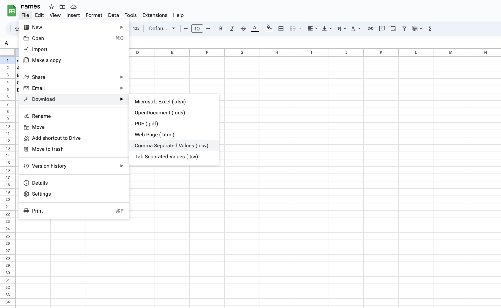
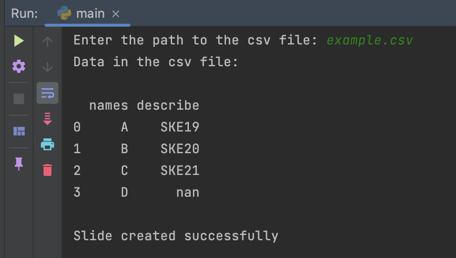
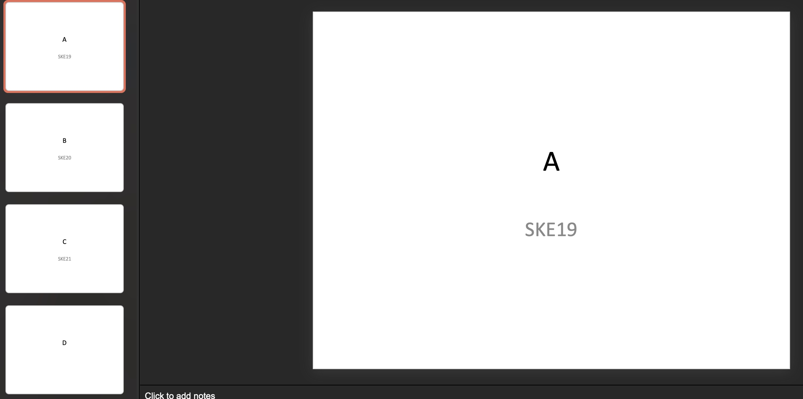
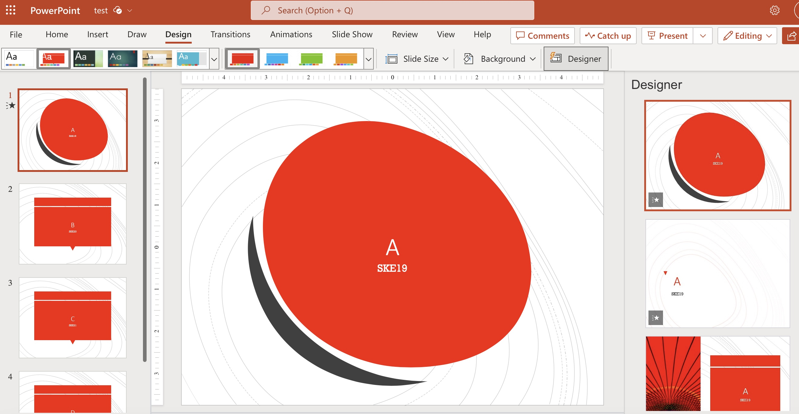

# csv_to_blank_powerpoint

## Description
A console-based program for quickly generating duplicate PowerPoint slides, such as name tags.

## Demonstration
1) You'll need to have a .csv file, let's say I will get it from Google Sheets.

2) Download all the dependencies (there are only 2) by typing in your console:

```
pip install -r requirements.txt
```

3) After you get all the dependencies, run the program and locate the .csv file path, the program will show you a data example in your console and generate the pp slide named "test.pptx"


## Example output:


## What next?
You can edit the .pptx file to your liking (E.g. Apply on your own template.)


## Constraint
Since I decided on the program for making name tags, In your .csv file can only contain 2 columns at the maximum.
